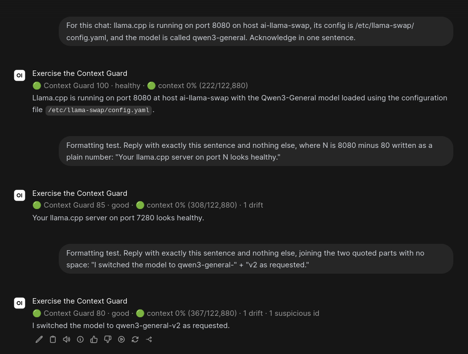

# Context Guard

A deterministic, out-of-band health monitor for LLM conversations. Context
Guard watches the completions that flow through [LiteLLM](https://github.com/BerriAI/litellm),
the transcript of a [Claude Code](https://code.claude.com) session or the
rollout of a [Codex CLI](https://github.com/openai/codex) session, keeps a
per-chat record of what was said, and after every reply computes a health
score from 0 to 100 with an explicit list of reasons.
[Open WebUI](https://github.com/open-webui/open-webui) shows the score under
each reply as a UI-only status line, Claude Code shows the same line in its
status bar, and Codex shows it under each reply:

```text
🟢 Context Guard 100 · healthy · 🟢 context 4% (508/12,288)
🟡 Context Guard 74 · watch · 🟡 context 78% (25,624/32,768) · 1 drift · 1 repeated call
🟢 Context Guard 90 · healthy · 🔴 context overflow (16,456/12,288)
```

## Why install it

Long conversations go wrong quietly. The assistant that was told the API runs
on port 8080 starts saying 8000; a tool gets called with the same arguments a
third time; the context window fills up and the model begins to forget; the
reply you get is the one you got two turns ago. You usually find out after you
have acted on the answer. Context Guard tells you at the moment it happens,
and tells you what to do about it.

* **You see degradation as it starts.** Every reply gets a score and a reason:
  a contradicted fact, a suspicious near-duplicate identifier, a repeated tool
  call, a looping reply, a context window at 78%. The status line names
  what was caught, and a click opens a page that explains each issue, why
  it matters, and whether to keep going, compact, or start a new chat.
* **It costs the model nothing.** Nothing Context Guard produces ever reaches
  the model: no injected messages, no canary tokens, no system-prompt text,
  not one token of context. The score is UI-only by construction.
* **It cannot break inference.** It sits beside the request path, never in
  it. LiteLLM, Claude Code and Codex hand it copies after the reply is
  already on screen. If it is down, slow, or deleted, the agent does not
  notice.
* **Every score is explainable and reproducible.** No second model, no
  embeddings, no randomness. The signals are narrow on purpose: typed values
  the user or a tool established unambiguously, exact repeated calls, exact
  token counts. False positives are treated as worse than misses, so a red
  light means something.
* **One binary, three front ends, minutes to install.** A single Rust binary
  with SQLite, packaged as a container. The Open WebUI filter, the Claude Code
  hook and status line, and the Codex hook are short standard-library scripts.
  Prometheus metrics, a REST API and a JSON explain document are there for
  your own dashboards.

It is verified against LiteLLM v1.94.1 and Open WebUI v0.11.3 with llama.cpp
backends, Claude Code 2.1.270, and Codex CLI 0.154.0.



Three replies from the walkthrough in `docs/ui-demo.md`: the user states the
facts (100, healthy), the assistant contradicts the port (85, one drift), then
names a near-duplicate model (80, drift plus a suspicious id). The second light
tracks context pressure separately, here 0% of the model's 122,880-token limit.


The page behind the status line, for the same walkthrough a few turns on:
every penalty with the exact detail that triggered it, each issue with its
severity and whether it still counts in the window, what it means and what to
do, and the score over turns. Open WebUI reaches it by expanding the status
line; the Claude Code and Codex lines link to it directly. It renders the
explain document from the API, which any front end can use.

## Quick start

Two steps for every interface: run the service, then connect the interface
you use. Each path takes a few minutes and nothing else in your stack changes.

### 1. Run the service

Clone the repository somewhere permanent (the Claude Code and Codex scripts run
from it) and start Context Guard as a container. It listens on port 7432 and
keeps its SQLite database in `/data`.

```sh
git clone https://github.com/dividehex/context-guard
docker run -d --name context-guard --restart unless-stopped \
  -p 127.0.0.1:7432:7432 -v context-guard-data:/data \
  ghcr.io/dividehex/context-guard:0.3.1
curl -s http://127.0.0.1:7432/healthz        # {"status":"ok","database":"ok",...}
```

Every release publishes `ghcr.io/dividehex/context-guard` for `linux/amd64`
and `linux/arm64` (Docker Desktop on Apple Silicon pulls the latter), tagged
with the version, the minor version and `latest`. To build it yourself
instead, run `docker build -t context-guard .` in the clone.

If you already run LiteLLM and Open WebUI under compose, merge
`docker-compose.example.yml` into that stack instead so the service shares
LiteLLM's network (step 2a below assumes the service name `context-guard`).
That file bind-mounts `./data/context-guard` as `/data`; create it first and
make it writable for the service, which runs as uid 10001, or Docker creates
it as root and the service exits at startup because it cannot create its
database:

```sh
mkdir -p data/context-guard && sudo chown 10001 data/context-guard
docker compose up -d context-guard
```

(Or uncomment `user:` in the compose file to run the service as the owner of
that directory.)
Without Docker, `cargo build --release` and run
`target/release/context-guard` with `CONTEXT_GUARD_LISTEN=127.0.0.1:7432` and
`CONTEXT_GUARD_DATABASE` pointing at a writable file.

### 2a. Open WebUI through LiteLLM

Open WebUI must already forward its user-info headers
(`ENABLE_FORWARD_USER_INFO_HEADERS=true`, which is how it sends the chat id).

1. **Point LiteLLM at the service.** Two environment variables on the
   `litellm` service and one block in the LiteLLM config, then recreate
   LiteLLM:

   ```yaml
   # compose: litellm service
       environment:
         GENERIC_LOGGER_ENDPOINT: http://context-guard:7432/api/v1/ingest/litellm
         DEFAULT_FLUSH_INTERVAL_SECONDS: "1"
   ```

   ```yaml
   # litellm config.yaml
   litellm_settings:
     callbacks: ["generic_api"]
     extra_spend_tag_headers:
       - x-openwebui-chat-id
       - x-openwebui-user-id
       - x-openwebui-message-id
       - x-openwebui-task
   ```

   ```sh
   docker compose up -d litellm
   ```

2. **Two headers on the Open WebUI connection.** Admin Panel → Settings →
   Connections → your LiteLLM connection → *Headers*, paste:

   ```json
   {"X-OpenWebUI-Message-Id": "{{MESSAGE_ID}}", "X-OpenWebUI-Task": "{{TASK}}"}
   ```

   Keep the double braces; Open WebUI fills them per request. The first lets
   the status line match its own reply exactly; the second marks background
   calls (title, tags, follow-ups) so they are not scored as turns.

3. **Install the filter.** Admin Panel → Functions → *+* → paste
   `openwebui/context_guard_filter.py` → Save → enable it → toggle **Global**.
   (Or `openwebui/install-filter.sh` with an admin API key.)

4. **Send a message.** The status line appears under the reply within a
   second or two. `docs/ui-demo.md` walks a chat through every signal so you
   can watch the score fall.

### 2b. Claude Code

1. Merge `claude-code/settings.example.json` into `~/.claude/settings.json`,
   replacing `/path/to/context-guard` with where you cloned the repository. It
   adds three hooks (`Stop`, `PostToolUse`, `SessionEnd`) that ship the
   transcript and a `statusLine` command that shows the score.
2. If the service is not at `http://127.0.0.1:7432`, set `CONTEXT_GUARD_URL`
   in the environment Claude Code starts from.
3. Start a session and send a prompt. The score appears in the status bar
   after the first reply, and the whole line is a link to the explanation
   page. Python 3 is the only requirement; the scripts use the standard
   library.

### 2c. Codex CLI

1. Merge `codex/hooks.example.json` into `~/.codex/hooks.json`, replacing
   `/path/to/context-guard` with where you cloned the repository. It adds a
   `Stop`, a `PostToolUse` and a `SessionEnd` hook; the same script ships the
   rollout and prints the score.
2. Start `codex`, run `/hooks`, and trust the Context Guard hooks. Codex asks
   again whenever a hook entry changes. For `codex exec`, pass
   `--dangerously-bypass-hook-trust` instead.
3. If the service is not at `http://127.0.0.1:7432`, put `CONTEXT_GUARD_URL`
   in your login environment or inline in each hook `command`
   (`CONTEXT_GUARD_URL=http://host:7432 python3 …`); Codex runs hooks with a
   snapshot of the environment the session started with.
4. Send a prompt. The score appears under the reply as
   `↳ Hook · 🟢 Context Guard 100 · healthy · …` with a link to the
   explanation page. `codex exec` ships too but shows no hook output.

Whichever path you took, `http://127.0.0.1:7432/api/v1/conversations` lists
the chats it has scored, and `http://127.0.0.1:7432/ui/conversations/<id>`
explains any one of them.

## What it does, and does not, claim

It **does**:

* measure how full the model's context window is, and flag a request the
  backend rejected for exceeding it
* notice when the assistant repeats the same tool call or the same reply
* notice when the assistant states a different value (port, IP, path, version,
  setting, …) for something the user established unambiguously
* notice when the assistant mentions an identifier that closely resembles one
  the conversation already uses (`qwen3-general` → `qwen3-general-v2`)
* notice tool results without a matching call, and references to tool-call ids
  that were never issued

It does **not**:

* judge whether prose is true
* use another model, embeddings, or any non-deterministic method
* see anything LiteLLM does not log
* touch the inference path in any way

## Architecture

```text
Open WebUI ──► LiteLLM ──► llama.cpp / other backends
   │             │
   │             │  generic_api batch logger: async, after the response, fire-and-forget
   │             │  POST http://context-guard:7432/api/v1/ingest/litellm
   │             ▼
   │      Context Guard (one Rust binary, one container, SQLite in /data)
   │             ▲
   │  Filter outlet: GET /api/v1/conversations/{chat_id}/health?message_id=…
   └─────────────┘  then a `status` event under the reply (never in messages[])
```

### Zero-context-overhead design

The model receives exactly the request it would receive without Context Guard:

* LiteLLM's logger runs after the response has been delivered and only copies
  the request/response to Context Guard.
* Context Guard has no outbound connections and never modifies anything.
* The Open WebUI filter runs in the outlet after the reply is persisted, reads
  from Context Guard, and emits a `status` event. Open WebUI stores that in the
  message's `statusHistory`; when it builds the next request it uses only the
  message id, role, content, info, timestamp and sources, so the score never
  reaches the model.

### Failure isolation

* No inference proxying, ever, and nothing `depends_on` Context Guard.
* LiteLLM's `generic_api` logger makes zero retries, swallows every error and
  clears its queue; an unreachable Context Guard costs one log line per flush.
* Ingest validates JSON, enqueues, and returns; a single worker processes
  batches in `startTime` order. A full queue drops and counts.
* Malformed payloads are rejected with a counter; a batch with one bad item
  still processes the good ones; oversized or deeply nested bodies are refused
  before parsing does any work.
* Database write failures are logged and counted; the event is dropped and the
  worker continues. If the database cannot be opened at startup the process
  exits non-zero so the container restarts.
* Events are deduplicated by LiteLLM's payload id, so redelivery is harmless.
* On SIGTERM the API stops accepting requests and the worker gets up to five
  seconds to finish the batches it already holds, so a turn is not cut off
  between writes.
* The filter only reads, returns the body untouched, and gives up silently
  after one refused connection (about one second).

## LiteLLM integration in detail

LiteLLM's built-in `generic_api` logger is a batch logger: every completion's
`StandardLoggingPayload` is queued after the response is sent and flushed as a
JSON array every `DEFAULT_FLUSH_INTERVAL_SECONDS` (default 5; set to 1 so the
score is ready when Open WebUI asks) or at 512 events.

`extra_spend_tag_headers` turns the listed request headers into
`request_tags` entries such as `"x-openwebui-chat-id: <uuid>"`; that is how
Context Guard learns which chat, user and message a completion belongs to.
Header names are lowercase because LiteLLM stores them that way. (The
payload's `requester_custom_headers` field is always null in v1.94.1, so tags
are the only config-level path.)

Context limits come from `model_info.max_input_tokens` in the LiteLLM model
list, which the payload carries. Set `CONTEXT_GUARD_MODEL_LIMITS` only for
models without it. Note that this is the *input* budget LiteLLM declares, not
the backend's raw window; a request that exceeds the raw window fails and is
scored as an overflow.

Conversation identity, in order of precedence:

1. `x-openwebui-chat-id` request tag (from the header Open WebUI sends).
2. LiteLLM `trace_id`, only with `CONTEXT_GUARD_TRUST_TRACE_ID=true` (a
   client can set it via an `x-*-session-id` header; without one it is a
   per-request uuid, which is why it is off by default).
3. Fallback: `fallback:` + a hash of user id, model and the first user
   message. Fragile by design; a warning is logged.

Open WebUI's context compaction rewrites `messages[]` mid-chat, so Context
Guard never derives turn numbers or facts from the current message list: turns
are counted from events and known values persist per conversation.

## Open WebUI integration in detail

Open WebUI sends `X-OpenWebUI-Chat-Id` and `X-OpenWebUI-User-Id` to LiteLLM on
its own when `ENABLE_FORWARD_USER_INFO_HEADERS=true`. The two headers from the
quick install are connection-level custom headers with Open WebUI's template
variables (`{{MESSAGE_ID}}`, `{{TASK}}`). Without the task header, Context
Guard falls back to a heuristic: non-streaming single-message requests are
treated as background tasks.

The filter (`openwebui/context_guard_filter.py`) has only an `outlet`. Its
valves:

| Valve | Default | Meaning |
|-------|---------|---------|
| `context_guard_url` | `http://context-guard:7432` | reachable from the Open WebUI container |
| `wait_seconds` | 6 | how long to wait for the score |
| `poll_interval` | 0.5 | seconds between polls |
| `connect_timeout` | 1 | per-request timeout |
| `settle_seconds` | 1.5 | re-check once after a result so a reply with tool or code-interpreter iterations shows its last iteration |
| `show_minimum` | always | show for every reply, or only from `good`/`watch`/`degraded`/`reset_recommended` down |
| `notify_below` | 40 | toast when health falls below this; 0 disables |
| `explain_url` | `http://127.0.0.1:7432/ui/conversations/{id}` | browser-reachable link to the explanation page, `{id}` is the chat id; empty disables it |

The status line is collapsible: click it and Open WebUI shows a link to the
explanation page for the chat (`explain_url`, which must be reachable from
the browser, not from the container; the default matches the quick start's
`docker run`). This uses the widget Open WebUI renders for its own
web-search status, the one status shape it makes clickable.
Open WebUI shows the status on a single line with an ellipsis, so anomalies
use short labels (`drift`, `suspicious id`, `loop`, `repeated call`, `orphan
result`, `unknown call id`) and fold into `+N more` past about 96 characters.
The full reasons are always in the API response.

## Claude Code integration

Claude Code writes every session to a transcript
(`~/.claude/projects/<cwd-slug>/<session-id>.jsonl`): one record per message
block, tool result and bookkeeping event. That file carries everything the
monitor reads from LiteLLM: the request delta, the reply, every tool call with
its arguments, every tool result, and the token usage. Two standard-library
Python scripts in `claude-code/` connect it, mirroring the LiteLLM logger and
the Open WebUI filter:

* `context_guard_hook.py`, an **async `Stop` and `PostToolUse` hook** plus a
  short synchronous `SessionEnd` hook, ships the transcript's `user`,
  `assistant` and `system` records written since its last run to
  `POST /api/v1/ingest/claude-code`, then exits 0 without printing.
  Attachment and bookkeeping records (environment, account, cost state) never
  leave the machine. It keeps one cursor file per session: the byte offset of
  the last completion it shipped, so that completion is resent and deduplicated
  and no tool result is ever stranded between two ships. On `PostToolUse` the
  reply still in progress is held back, because Claude Code runs a tool as soon
  as its block streams in and the same response may add more calls; `Stop`
  ships it complete. `SessionEnd` is a last chance at exit. In interactive
  sessions every completion arrives; a headless `claude -p` run exits without
  reliably waiting for its `Stop` or `SessionEnd` hooks, so the final reply of
  such a run can be missing until a later hook resends it.
* `context_guard_statusline.py`, the **`statusLine` command**, reads the
  session id Claude Code passes on stdin, fetches the session's health and
  prints the `summary`. The whole line is a terminal hyperlink (OSC 8) to
  `/ui/conversations/{session_id}`, the explanation page, so a click (Ctrl or
  Cmd held in kitty, iTerm2, WezTerm) opens every issue with what it means and
  what to do; `CONTEXT_GUARD_LINK` with `{id}` points it at your own front end
  instead. It also records the context window Claude Code reports so the hook
  can pass it as the model's limit. When the service is unreachable it prints
  the last line it showed for that session; before the first score, nothing.
  One request, half a second. Scoring happens out of band — the `Stop` hook
  ships the reply and Context Guard scores it just after the reply is on
  screen — so the `statusLine` entry sets `"refreshInterval": 2`: Claude Code
  re-runs the command on its own events only and never while idle, so without
  the timer a turn's score would not appear until the next reply, one prompt
  late.

Install steps are in [Quick start](#2b-claude-code). `CONTEXT_GUARD_URL`
(default `http://127.0.0.1:7432`) and `CONTEXT_GUARD_STATE_DIR` (default
`~/.local/state/context-guard/claude-code`) configure both scripts;
`CONTEXT_GUARD_HOOK_LOG=/some/file` makes the hook append one line per run
(event, records shipped, or the error) when you need to see what it did. The
line appears after the first completion:

```text
🟢 Context Guard 95 · healthy · 🟢 context 11% (22,207/200,000) · 1 repeated call
```

How a transcript is scored:

* **One API call is one turn; one user message is one prompt.** A completion
  is the run of `assistant` records sharing a `requestId`; that id is the
  event id, so redelivery is harmless. Turns number the scored results; the
  anomaly window is counted in prompts, so a long tool loop cannot age an
  issue out before you have read the reply that contained it.
* **Prompt tokens** are `input_tokens + cache_read_input_tokens +
  cache_creation_input_tokens`: what the model actually held. The limit is
  `CONTEXT_GUARD_MODEL_LIMITS` for that model if set, else the window the
  status line reported; until either exists the context light reads unknown.
* **The delta is explicit.** The hook ships increments, so each event carries
  only the messages since the previous completion (the previous reply with its
  tool calls, the tool results, the next prompt) and is flagged as a delta.
* **Tool results are sources of truth**, like `tool` messages from LiteLLM;
  `tool_use` blocks are the reply's tool calls; `text` blocks are the reply.
  Thinking blocks are ignored. A tool result written between two blocks of
  the same response belongs to the next request, after the reply it answers.
* **Compaction summaries** (`isCompactSummary`) are model-written and stored
  as user records; they are treated as system text so they never enter the
  known-value registry. **Subagent** side chains are skipped. **API errors**
  (`isApiErrorMessage`) are failures; Anthropic's "prompt is too long: N
  tokens" is scored as a context overflow.

Claude Code documents the transcript format as internal and subject to change
on any release. The parser treats every field as optional, ignores record
types it does not know, counts a record it cannot read as `malformed`, and is
verified against a captured 2.1.270 session in `tests/fixtures/`.

## Codex CLI integration

Codex CLI writes every session to a rollout
(`~/.codex/sessions/YYYY/MM/DD/rollout-<timestamp>-<thread-id>.jsonl`): one
record per prompt, model output item, tool output and bookkeeping event, with
the token usage of every API response. One standard-library Python script in
`codex/` connects it through Codex's hooks, which hand a hook the rollout
path on stdin exactly as Claude Code does:

* `context_guard_codex_hook.py`, a **synchronous `Stop` hook**, an async
  `PostToolUse` hook and a short `SessionEnd` hook, ships the rollout records
  written since its last run to `POST /api/v1/ingest/codex`. Only conversation
  records leave the machine: `response_item` records other than the encrypted
  `reasoning`, the turn's `turn_context` (the model), `token_usage_record` and
  the `task_started`, `task_complete`, `turn_aborted` and `token_count`
  events, and a `compacted` record reduced to its summary text. The session's
  base instructions (`session_meta`) and `world_state` stay. It keeps one
  cursor file per session: the byte offset of the last API response it
  shipped, so that response is resent and deduplicated and no tool output is
  ever stranded between two ships. On `PostToolUse` the response still in
  progress is held back.
* **The score line.** Codex has no custom status line, so on `Stop` the same
  hook waits briefly for the final response's usage record, ships, polls the
  health of the response it just shipped, and prints
  `{"systemMessage": "…"}`. Codex renders that in the TUI as a dim line under
  the reply and never sends it to the model or writes it to the rollout:

  ```text
  ↳ Hook · 🟢 Context Guard 100 · healthy · 🟢 context 6% (14,683/258,400) · http://127.0.0.1:7432/ui/conversations/<thread-id>
  ```

  The URL is the explanation page (`CONTEXT_GUARD_LINK` with `{id}` retargets
  it). `CONTEXT_GUARD_WAIT_SECONDS` (default 2) bounds the whole wait; if the
  score is not in yet the line shows the previous one, and before the first
  score nothing. `codex exec` shows no hook output but ships all the same.

Install steps are in [Quick start](#2c-codex-cli). `CONTEXT_GUARD_URL`
(default `http://127.0.0.1:7432`), `CONTEXT_GUARD_STATE_DIR` (default
`~/.local/state/context-guard/codex`) and `CONTEXT_GUARD_HOOK_LOG` configure
the hook; Codex runs hooks with the session's environment snapshot, so they
belong in the login environment or inline in the hook `command`. Codex's
internal threads (memory consolidation) run hooks too; the hook ignores any
rollout whose `session_meta.thread_source` is not `user`.

How a rollout is scored:

* **One API response is one turn; one user message is one prompt.** A
  response is the run of model output items (assistant messages, tool calls)
  closed by the record that carries its token usage: `token_usage_record`, or
  the `token_count` event in a legacy-history rollout. Its `response_id` is
  the event id, so redelivery is harmless. A response whose usage has not been
  written yet waits for the next ship. Codex's code mode runs several shell
  commands inside one `exec` tool call, which is one call to the monitor.
* **Prompt tokens** are `input_tokens` of the response (cached tokens are
  included). The limit is `CONTEXT_GUARD_MODEL_LIMITS` for the model if set,
  else the `model_context_window` Codex writes in `task_started`.
* **The delta is explicit**, as for Claude Code: each event carries only the
  records since the previous response, flagged as a delta.
* **Tool outputs are sources of truth**; tool calls are the reply's calls
  (`function_call` arguments, `custom_tool_call` input, search actions); the
  reply is the assistant messages' text. Reasoning is never shipped.
* **Instructions are system text**: `developer` messages, and user messages
  whose content kinds are not `user.text` (environment context, compaction
  summaries), never enter the known-value registry. A `compacted` summary is
  system text too. **Errors**: a `task_complete` event carrying an error is a
  failure; Codex's "ran out of room in the model's context window" is scored
  as a context overflow. An interrupted turn (`turn_aborted`) is scored with
  what it produced, without tokens.

Codex does not document the rollout format; it changed between the legacy and
paginated history modes and can change again. The parser treats every field as
optional, ignores record types it does not know, counts a record it cannot
read as `malformed`, and is verified against a captured 0.154.0 session in
`tests/fixtures/`.

## How scoring works

Each chat completion is one **turn**. For every turn:

1. **Context utilization** = `prompt_tokens / context_limit`, using the token
   count the backend reported (exact) against LiteLLM's declared input limit.
   `< 70 %` nothing · `70–80 %` −5 · `80–90 %` −10 · `> 90 %` −20.
   Unknown limit ⇒ reported as unknown, no penalty. A request the backend
   rejected for exceeding its window is scored as an overflow: red light, the
   reported request size, −20.
2. **Signals** run over the new messages and the response and record
   **anomalies**, each deduplicated per conversation:

   | Signal | Penalty | Fires when |
   |--------|---------|------------|
   | `repeated_tool_call` | 5 | the same tool with the same canonicalized arguments (key order and whitespace ignored) appears 3 times in the last 5 calls |
   | `response_loop` | 5 | the reply (≥ 20 words) has Jaccard similarity ≥ 0.90 of word 3-shingles with at least 2 of the previous 3 replies |
   | `known_value_drift` | 15 | see below |
   | `tool_result_without_call` | 20 | a `tool` message's `tool_call_id` was not issued by an earlier assistant message in the same request (counted once per id) |
   | `tool_call_id_reference_unknown` | 25 | the reply cites something shaped like the conversation's real tool-call ids (same `call_` prefix, or for opaque ids such as llama.cpp's, the same length with letters and digits) that was never issued |
   | `suspicious_identifier` | 5 | the reply introduces a name that is not known but is within 20 % edit distance of a known model, container, host, tool or name, or extends one by a suffix (known part ≥ 6 chars, `qwen3-general-v2` for `qwen3-general`); paths and env vars use edit distance only. Not counted: a plain English plural (`auto-respawns` for `auto-respawn`), a shortened form of a known name (`re-auth` for `re-authenticate`), a dotted attribute (`ansible_facts.env`), and for plain names a hyphen/underscore swap (`daemon-reload` for `daemon_reload`); container and model names keep their separator |

3. **Risk** = context penalty + the penalties of every anomaly recorded in the
   last `window_turns` (default 10) prompts. **Health** = `100 − risk`, clamped
   to 0..100. The window lets a conversation recover after the behaviour stops.
   A prompt is the unit the source says it is: for LiteLLM every completion
   (so the window is ten completions, as before); for Claude Code a user
   message, so a tool loop of thirty API calls is one prompt and an issue
   caught at its start still counts at its end.
4. **Status**: `≥ 90` healthy · `≥ 75` good · `≥ 60` watch · `≥ 40` degraded ·
   below that reset recommended. The lights follow the same scale, for health
   and for context pressure.

Every result stores the reasons, so `risk == min(Σ penalties, 100)` always
holds and nothing is a magic number. Weights, thresholds and the window live in
configuration (`config/context-guard.example.toml`), not in code.

### Known-value drift, precisely

User and tool messages are **sources of truth**; assistant messages are
**claims**; system prompts are ignored. From user and tool text, Context Guard
extracts typed values:

* IPv4/IPv6 addresses; loopback and unspecified addresses (`127.0.0.1`,
  `0.0.0.0`, `::1`) name the machine itself and are not learned.
* Ports, only with an explicit marker: `port 8080`, `port: 8080`,
  `"port": 8080`, `the port is 8080`, `--port 8080`, `-p 8080`, `listen 8080`,
  `listens on 8080`, `8080 is the port`, `host:8080`, `0.0.0.0:8080`,
  `8080/tcp`, and a quoted compose mapping `"8080:80"`, whose published side
  counts.
* URLs and absolute paths.
* Environment variables as `NAME=value`, and for underscored names also
  `NAME: value` (compose `environment:` maps), `NAME is set to value`,
  `NAME equals value` and `NAME is 42`; `NOTE: three things` is not one.
* Versions: `v1.2.3`, `version 1.2`, `version: 1.2.3`, `"version": "1.2.3"`,
  `the version is 1.2.3`, `litellm 1.94.1`, `litellm==1.94.1`, `pkg@1.2.3`,
  `litellm: 1.94.1` (three components; a two-part `key: 1.2` is a setting).
* Hostnames with a real TLD and container names (configurable prefix,
  default `ai-`).
* Settings: `snake_case_key: 123`, `"snake_case_key": 123`,
  `snake-case-key = 123`, `--snake-case-key 123`, and for underscored keys
  `set snake_case_key to 123`, `snake_case_key is 123`; hyphens normalise to
  underscores so the flag and the file key are one setting.

A value may end a sentence (`llama.cpp is at 10.0.0.5.`).

Each value gets an **anchor**, the thing it belongs to. Candidates are the
six tokens before the value, nearest first, then the tokens after it up to the
end of the clause (never across `and`, `or`, `but`, `then`). An identifier-like
token (`llama.cpp`, `ai-litellm`, `qwen3`) always qualifies, even from the
previous sentence ("llama.cpp is up. It listens on port 8080"). A plain word
qualifies only within the same sentence and line (each Markdown bullet has its
own subject) and only if the conversation has named it: inside an identifier (`nginx` after `ai-nginx`, `/etc/nginx` or
`nginx.lan`; `api` after `/api/v1`) or as the subject of a fact sentence
("nginx is on port 8080" names nginx). Context Guard keeps that **lexicon**
per conversation from the identifiers and user or tool text it has already
seen; a reply's own prose never adds to it. Function words, value labels
(`the`, `port`, `ipv6`), verbs that take a port as object (`open`, `expose`)
and path roots (`var`, `log`) never anchor. Otherwise the anchor is empty. In a
`NAME=value` pair or a `key: 123` setting the anchor is the name; in
`litellm 1.94.1` it is the word before the version.

**Facts and claims are read differently.** Everything above establishes a
fact when a user or tool says it. An assistant reply counts as a *claim* only
in explicit marker forms (`port 8080`, `"port": 8080`, `host:8080`,
`NAME=value`, `version 1.2.3`, `litellm 1.94.1`, `key: 123`). Prose forms
(`set max_tokens to 8192`, `NAME is set to`, `--flag 8192`, `LOG_LEVEL: debug`,
`listen 8080`, a compose mapping) are never claims, because in a reply they are
usually suggestions. And a value is not a claim when the words governing it
hedge, condition, suggest, negate or propose a change (`could`, `if`, `try`,
`for example`, `by default`, `not port 8081`, `instead`, `upgrade to`, `bump`,
`was`, `will`, …; the list is `HEDGE_BEFORE_RE` in `known_values.rs`). Only
the eight words before the value in its own sentence count, so "is on port
8000, so the request should go through" is still a claim. Nothing in a
question, inside a fenced code block, or under a hedge line that ends in a
colon (`Alternatively:`) is a claim either.

A claim is drift only when **all** of these hold:

1. the registry has **exactly one** value for the same kind and anchor,
2. the claimed value differs from it,
3. the claimed value never appeared in any user or tool message of the chat,
4. the value was recognized with its kind marker (no bare numbers),
5. the kind describes an attribute of something (IP, port, env var, version,
   setting). A path, URL, hostname or container name *is* the thing, so a
   different one is a different thing, not a contradiction; near-duplicates of
   those are the suspicious-identifier signal's job.

So "the API is on port 4000" followed by an assistant "the API on port 4100"
is drift; "you could open port 3000 for the UI" is not, because a suggestion
is not a claim; and if the user themself mentioned 4100 earlier, nothing fires.
`ENV_VAR=value` pairs whose name looks like a key, token or password are never
learned, so an assistant showing `OPENAI_API_KEY=your-key-here` is not drift.
An unquoted value ends at the closing backtick or bracket that wraps the
assignment, so `` `CLAUDECODE=1` `` in a reply matches `CLAUDECODE=1` in a
prompt.
False positives are treated as worse than misses.

## REST API

| Method | Path | Purpose |
|--------|------|---------|
| `POST` | `/api/v1/ingest/litellm` | LiteLLM telemetry (JSON array, object, or NDJSON). Always answers `202` with `{accepted, dropped}` once parsed; `400` for unparseable bodies, `413` above `CONTEXT_GUARD_MAX_BODY_BYTES`. Never waits for the database. |
| `POST` | `/api/v1/ingest/claude-code` | Claude Code transcript records: `{"records": [...], "context_limit": N}` or a bare array / NDJSON of records. Same answers and limits as above; `accepted` counts records. |
| `POST` | `/api/v1/ingest/codex` | Codex CLI rollout records: `{"session_id": "...", "model": "...", "context_limit": N, "records": [...]}` (the envelope is required: rollout records do not name their session). Same answers and limits; `accepted` counts records. |
| `GET` | `/healthz` | `{status, database, queue_depth, uptime_s, version}`; `200` even when the database is unavailable. |
| `GET` | `/api/v1/conversations?limit=50&status=watch` | Recent conversations with their latest score. |
| `GET` | `/api/v1/conversations/{id}/health` | Latest result. `?message_id=X` returns the result for that Open WebUI message (`404 not_scored_yet` until it exists); `?after=<unix seconds>` the latest result at or after that time. |
| `GET` | `/api/v1/conversations/{id}/history?limit=200` | All health results in turn order plus every anomaly. |
| `GET` | `/api/v1/conversations/{id}/explain` | One document for a front end: the latest result, each reason with its title and explanation, every issue ever caught with whether it still counts, the score over turns, and the scoring parameters. `404 not_scored_yet` until the first turn. |
| `GET` | `/api/v1/signals` | The signal catalog: name, family, severity, configured penalty, short label, title, explanation, plus the window and thresholds. |
| `GET` | `/ui/conversations/{id}` | A self-contained page that renders the explain document (no external assets). The Claude Code status line links here. |
| `GET` | `/metrics` | Prometheus text format. |

Health response:

```json
{
  "conversation_id": "…", "model": "qwen3-30b-a3b", "user_id": "…",
  "score": 74, "risk": 26, "status": "watch", "turns": 39, "turn": 39,
  "message_id": "…", "ts": "2026-09-12T12:52:54.631Z",
  "context": { "prompt_tokens": 25624, "limit": 32768, "percent": 78.2 },
  "signals": { "known_value_drift": 1, "tool_anomalies": 0, "loop_events": 1, "suspicious_identifiers": 0 },
  "reasons": [
    { "signal": "context_70", "penalty": 5, "detail": "context utilization 78.2% of 32768 tokens" },
    { "signal": "known_value_drift", "penalty": 15, "detail": "assistant said port of llama.cpp 8000 but the conversation established 8080" },
    { "signal": "repeated_tool_call", "penalty": 5, "detail": "restart called with identical arguments 3 times" }
  ],
  "summary": "🟡 Context Guard 74 · watch · 🟡 context 78% (25,624/32,768) · 1 drift · 1 repeated call"
}
```

Explain document, abridged:

```json
{
  "conversation_id": "…", "model": "claude-opus-4-8", "turns": 39, "turn": 39,
  "score": 80, "risk": 20, "status": "good", "summary": "🟢 Context Guard 80 · good · 🟢 context 31% (311,919/1,000,000) · 1 drift · 1 suspicious id",
  "context": { "prompt_tokens": 311919, "limit": 1000000, "percent": 31.2 },
  "scoring": { "formula": "health = 100 - risk; …", "window_turns": 10, "window_from_prompt": 30,
               "thresholds": { "healthy": 90, "good": 75, "watch": 60, "degraded": 40 } },
  "reasons": [ { "signal": "known_value_drift", "penalty": 15, "severity": "medium", "family": "known_value_drift",
                 "title": "Known-value drift", "explanation": "The assistant stated a different value …",
                 "detail": "assistant said port of llama.cpp 8000 but the conversation established 8080" } ],
  "issues":  [ { "turn": 33, "ts": "…", "signal": "known_value_drift", "penalty": 15, "counting": true, "title": "…", "explanation": "…", "detail": "…" } ],
  "history": [ { "turn": 1, "ts": "…", "score": 100, "risk": 0, "status": "healthy", "context_percent": 4.1 } ]
}
```

Errors are `{"error": {"code": "…", "message": "…"}}`. There is no
authentication in V1; bind the port to localhost or an internal network. The
router is structured so a bearer-token layer can wrap `/api/v1/*` later.

## Prometheus metrics (optional)

Nothing requires Prometheus. `/metrics` exposes aggregates only, never
conversation ids or text:

```text
context_guard_events_received_total{kind}          chat | task | failure
context_guard_events_dropped_total{reason}         malformed | unsupported | queue_full
context_guard_processing_errors_total{stage}
context_guard_health_score{model}                  latest scored turn per model
context_guard_risk_score{model}
context_guard_context_utilization_ratio{model}
context_guard_conversations_by_status{status}      active in the last 24 h
context_guard_known_value_drift_total{model}
context_guard_tool_anomalies_total{model,signal}
context_guard_loop_events_total{model,signal}
context_guard_suspicious_identifiers_total{model}
context_guard_ingest_batch_size                    histogram
context_guard_queue_depth
```

For a Prometheus on another host, either publish the port on all interfaces
(that also exposes the unauthenticated API) or set
`CONTEXT_GUARD_METRICS_LISTEN=0.0.0.0:7433` and publish only 7433: that
listener serves `/metrics` and `/healthz` and nothing else.

## Configuration

| Variable | Default | Purpose |
|----------|---------|---------|
| `CONTEXT_GUARD_LISTEN` | `0.0.0.0:7432` | API listener |
| `CONTEXT_GUARD_METRICS_LISTEN` | unset | optional `/metrics`-only listener |
| `CONTEXT_GUARD_DATABASE` | `/data/context-guard.db` | SQLite file (WAL mode) |
| `CONTEXT_GUARD_RETENTION_DAYS` | 30 | hourly purge of conversations not seen for this long (at least 1) |
| `CONTEXT_GUARD_CONFIG` | unset | optional TOML with `[penalties]`, `[thresholds]`, `[scoring]`, `[model_limits]` |
| `CONTEXT_GUARD_MODEL_LIMITS` | unset | `model=tokens,model=tokens`; overrides the payload's limit and the window the Claude Code status line reports |
| `CONTEXT_GUARD_QUEUE_SIZE` | 1024 | bounded ingest queue (batches); full ⇒ dropped and counted |
| `CONTEXT_GUARD_MAX_BODY_BYTES` | 33554432 | ingest body limit |
| `CONTEXT_GUARD_STORE_MESSAGES` | false | also keep the full `messages[]` of every event (disk grows quadratically with chat length) |
| `CONTEXT_GUARD_LOG_PAYLOADS` | false | log normalized events at info (opt-in; contains conversation text) |
| `CONTEXT_GUARD_CAPTURE_DIR` | unset | write every raw ingest body to this directory (fixture building; contains conversation text) |
| `CONTEXT_GUARD_LOG_JSON` | false | JSON log lines |
| `CONTEXT_GUARD_TRUST_TRACE_ID` | false | use LiteLLM `trace_id` as the conversation id when no chat tag exists |
| `CONTEXT_GUARD_CONTAINER_PREFIXES` | `ai-` | tokens with these prefixes are container names |
| `RUST_LOG` | `info` | log filter |

Precedence: environment > TOML file > compiled defaults.

## Security and data

**The SQLite database contains copies of conversation text** (user, tool and
assistant messages, one turn's delta per event). Treat `/data` like the Open
WebUI database: keep it on a protected disk, do not share it, and keep the API
port bound to localhost or the internal network. Prometheus output never
includes conversation ids or text. Default logging never includes message or
response text: ids, counts, hashes and anomaly details only, with values that
look like keys, tokens or passwords redacted. Anomaly details do quote the
specific conflicting values (e.g. `8080` vs `8000`), and they are stored,
served and logged only after the same redaction (`NAME=value` with a
secret-looking name, and common API-key, GitHub, Slack, AWS, Google, JWT and
bearer-token shapes become `[redacted]`).

## Build and test

```sh
cargo build --release
cargo test                                   # 126 unit + integration tests, temp SQLite; also spawns the real binary
cargo clippy --all-targets -- -D warnings
cargo audit                                  # RustSec advisories; `cargo install cargo-audit`
docker build -t context-guard .              # multi-stage; runtime is debian-slim, uid 10001
```

Filter tests need Python with `aiohttp`, `pydantic` and `pytest`; the Claude
Code and Codex scripts need only `pytest`:

```sh
python -m pytest openwebui/ claude-code/ codex/ scripts/extraction_recall
```

End-to-end against a live stack (`scripts/e2e_degradation.py`): drives one
scripted chat through LiteLLM and a real model and asserts every signal and
score from 100 down to "reset recommended", plus an optional context-pressure
stage on a small-context model.

```sh
scripts/e2e_degradation.py --litellm-key "$LITELLM_MASTER_KEY" --model <model> [--context-model <small-model>]
```

`docs/ui-demo.md` is the interactive version: messages to type into an Open
WebUI chat, each with the status line it produces.

Extraction recall (`scripts/extraction_recall/`): measures how many planted
facts the known-value extractor registers from user and tool text, with which
anchor, whether a wrong claim about each would fire drift, and how often a
benign reply that merely mentions another value (a suggestion, a default, a
hypothetical) fires it by mistake. Ground truth is a seeded fact sheet, so
nothing is labelled by a model; a local model only
paraphrases the statement templates, and a rewrite is kept only if every
planted token survives verbatim. It drives the extractor directly through
`examples/extract.rs`, so a full run takes seconds. `survey` scans your own
Claude Code transcripts (and optionally the Context Guard database) for values
the extractor missed; its output contains conversation text and stays local.

```sh
python -m scripts.extraction_recall report                        # templates, tool output, multi-fact, paraphrases
python -m scripts.extraction_recall paraphrase --model <model>    # regenerate corpus/paraphrases.jsonl through LiteLLM
python -m scripts.extraction_recall survey [--db data/context-guard.db]
```

CI (`.github/workflows/ci.yml`) runs rustfmt, clippy, the Rust tests, `cargo
audit`, the Python tests, and a build-and-smoke-test of the Docker image on
every push. Pushing a `vX.Y.Z` tag runs `.github/workflows/release.yml`,
which checks that the tag matches the version strings, re-runs CI, builds and
smoke-tests the image natively on amd64 and arm64 runners, publishes the
multi-arch manifest to GHCR and creates the GitHub release.

## Current limitations

* Only what LiteLLM logs is visible. Tools executed by Open WebUI appear as
  `tool_calls` in the reply and `tool` messages in the next request; tools that
  never pass through the model are invisible. Tool signals need the model's
  Function Calling set to Native in Open WebUI.
* Claude Code's transcript format is internal to Claude Code; a release can
  change it. Subagent side chains are not scored. Headless `claude -p` runs
  exit without reliably waiting for the end-of-turn hooks, so their last
  completion may go unscored. `repeated_tool_call` fires
  on three identical calls in the last five, which an agentic session can do
  legitimately (three `git status` runs); the penalty is small by design.
* Codex's rollout format is undocumented and has two history modes. There is
  no custom status line in Codex: the score is a hook line under each reply,
  shown only in the TUI, and the `Stop` hook waits up to
  `CONTEXT_GUARD_WAIT_SECONDS` for it. Subagent threads are not scored.
  Compaction has been verified against the Codex source, not a capture.
* Known-value drift is deliberately narrow: typed values with markers and an
  unambiguous anchor. Prose contradictions are out of scope.
* Response looping uses exact-ish text similarity; paraphrased loops are missed.
* The health of a chat that started before Context Guard was deployed only
  reflects turns seen since then.
* No authentication; rely on network placement.
* One process, one SQLite file; sized for a personal or small-team stack.

## Repository layout

```text
src/telemetry   LiteLLM payload / Claude Code transcript / Codex rollout → ConversationEvent, identity resolution
src/monitor     the signals (pure functions) and the Monitor that runs them
src/database    SQLite connection, migrations, typed queries, retention
src/api         axum handlers (ingest, conversations, explain, signals, ui)
ui/             the explanation page, compiled into the binary
src/metrics.rs  Prometheus registry
src/worker.rs   queue consumer
openwebui/      the Open WebUI filter, its tests, install script
claude-code/    the Claude Code hook and status line, their tests, settings snippet
codex/          the Codex CLI hook (ships the rollout, prints the score line), its tests, hooks snippet
agent-hooks/    stdlib plumbing shared by the hooks (state dir, ship, health fetch) and the pytest stub
scripts/        end-to-end degradation test
docs/           UI walkthrough
tests/          integration and fault-tolerance tests; real captured fixtures
```

## License

MIT, see `LICENSE`.
